<a id="readme-top"></a>

<!-- PROJECT LOGO -->

<br />
<div align="center">
  <a href="https://github.com/M1KUAPP/bhel">
    <picture>
      <source media="(prefers-color-scheme: dark)" srcset="docs/readme/banner-dark.png">
      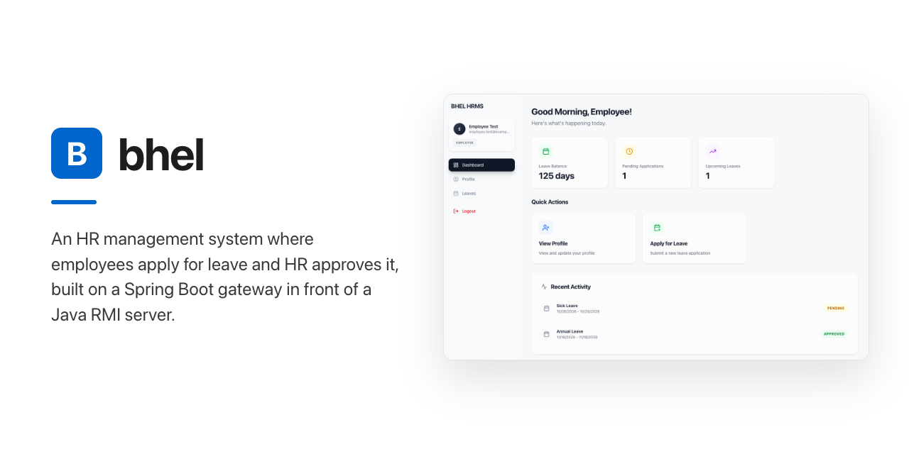
    </picture>
  </a>

  <h3>bhel</h3>

  <p>
    An HR management system where employees apply for leave and HR approves it, built on a Spring Boot gateway in front of a Java RMI server.
    <br />
    <a href="#getting-started"><strong>Run Locally »</strong></a>
    &middot;
    <a href="#screenshots">Screenshots</a>
    &middot;
    <a href="https://github.com/M1KUAPP/bhel/issues/new?labels=bug">Report a Bug</a>
    <br />
  </p>

[![TypeScript][typescript-badge]][typescript-url]
[![Java][java-badge]][java-url]
[![Next.js][nextjs-badge]][nextjs-url]
[![React][react-badge]][react-url]
[![Tailwind CSS][tailwindcss-badge]][tailwindcss-url]
[![Spring Boot][springboot-badge]][springboot-url]
[![Spring Security][springsecurity-badge]][springsecurity-url]
[![JWT][jwt-badge]][jwt-url]
[![PostgreSQL][postgresql-badge]][postgresql-url]
[![Apache Maven][apachemaven-badge]][apachemaven-url]
[![Bun][bun-badge]][bun-url]

</div>

<!-- TABLE OF CONTENTS -->

## Table of Contents

<details>
  <summary>Expand</summary>
  <ol>
    <li>
      <a href="#about-the-project">About The Project</a>
      <ul>
        <li><a href="#screenshots">Screenshots</a></li>
        <li><a href="#how-it-works">How It Works</a></li>
        <li><a href="#features">Features</a></li>
        <li><a href="#architecture">Architecture</a></li>
        <li><a href="#tech-stack">Tech Stack</a></li>
      </ul>
    </li>
    <li>
      <a href="#getting-started">Getting Started</a>
      <ul>
        <li><a href="#prerequisites">Prerequisites</a></li>
        <li><a href="#installation">Installation</a></li>
      </ul>
    </li>
    <li><a href="#roadmap">Roadmap</a></li>
    <li><a href="#team">Team</a></li>
    <li><a href="#license">License</a></li>
    <li><a href="#acknowledgments">Acknowledgments</a></li>
  </ol>
</details>

<!-- ABOUT THE PROJECT -->

## About The Project

bhel is a human resource management system for a company's staff. Employees keep their profile and family details up to date, check their leave balances and apply for leave. HR registers employees, approves or rejects leave, and generates yearly PDF reports.

It is built as a distributed system in three tiers. A Next.js web app calls a Spring Boot REST gateway, which authenticates each request with a JWT. The gateway then calls four remote services on a Java RMI server, and only the RMI server talks to PostgreSQL.

The repository holds two workloads under `apps/`:

- `apps/web/`: the Next.js 16 (App Router), React 19 and Tailwind CSS 4 web app.
- `apps/api/`: one Maven module (Java 17, Spring Boot 3.5) whose jar holds the REST gateway, the RMI server and the database initializer.

Built as coursework, where it earned an A+.

<p align="right"><a href="#readme-top">&uarr;</a></p>

### Screenshots

<table>
  <tr>
    <td width="50%" valign="top" align="left">
      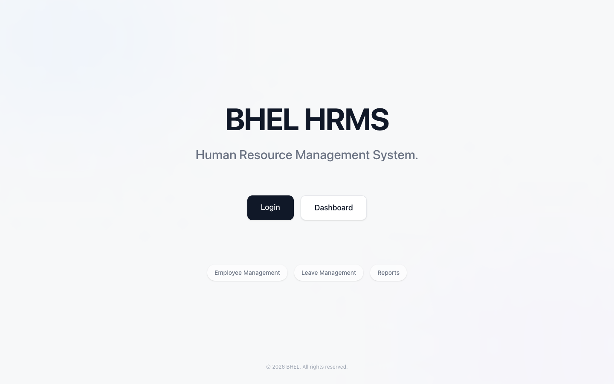
      <br />
      <strong>Landing Page</strong> · The entry point, with links to sign in or open the dashboard.
    </td>
    <td width="50%" valign="top" align="left">
      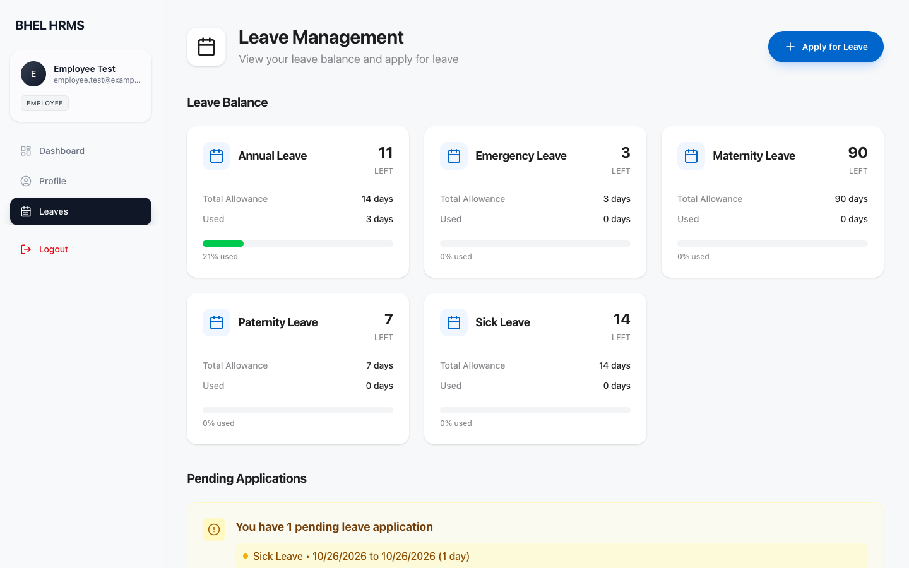
      <br />
      <strong>Leave Balances</strong> · Allowance, used and remaining days for each leave type, plus pending applications.
    </td>
  </tr>
  <tr>
    <td width="50%" valign="top" align="left">
      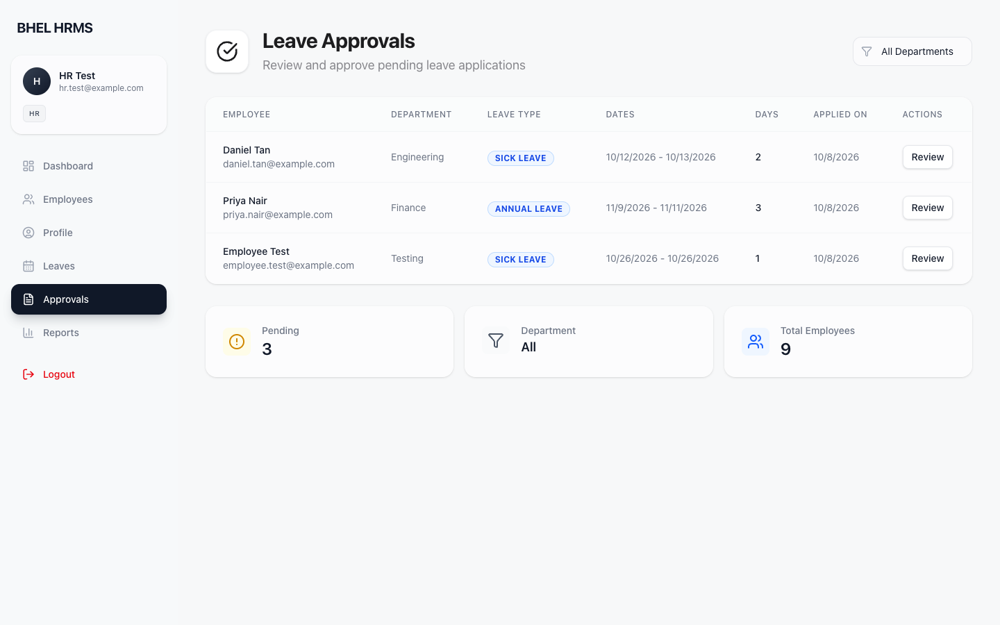
      <br />
      <strong>Leave Approvals</strong> · Every pending application in one queue, with a department filter.
    </td>
    <td width="50%" valign="top" align="left">
      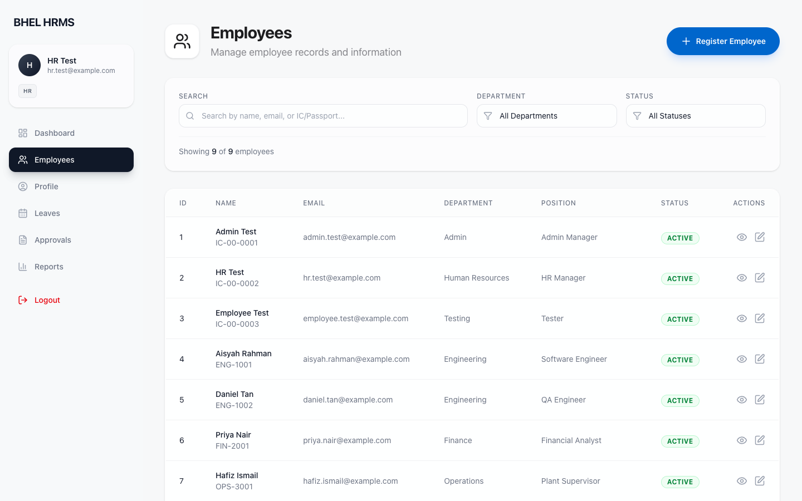
      <br />
      <strong>Employees</strong> · Search the directory by name, email or IC/passport, and filter by department and status.
    </td>
  </tr>
  <tr>
    <td width="50%" valign="top" align="left">
      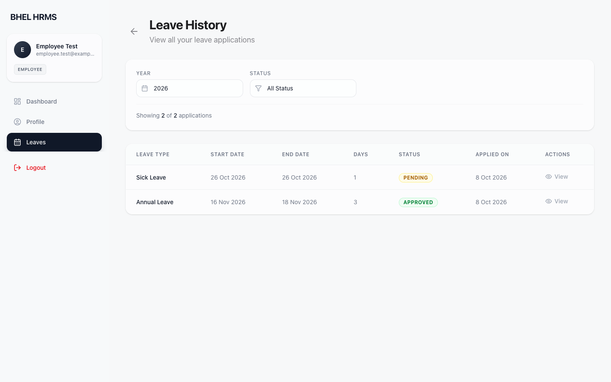
      <br />
      <strong>Leave History</strong> · An employee's applications for a year, filtered by status.
    </td>
    <td width="50%" valign="top" align="left">
      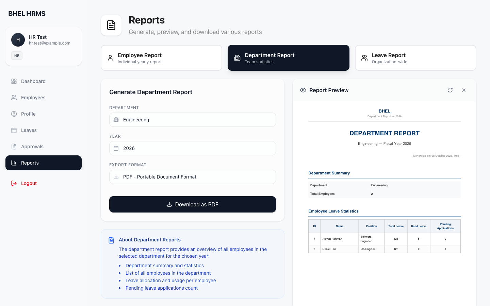
      <br />
      <strong>Department Report</strong> · A yearly department summary rendered as a PDF and previewed in the browser.
    </td>
  </tr>
</table>

<p align="right"><a href="#readme-top">&uarr;</a></p>

### How It Works

1.  **Sign in.** `/login` takes a username and password, and the gateway returns a JWT that carries the user's role: `EMPLOYEE`, `HR` or `ADMIN`. A fresh database has one login per role: `employee`, `hr` and `admin`, each with its username as the password.

    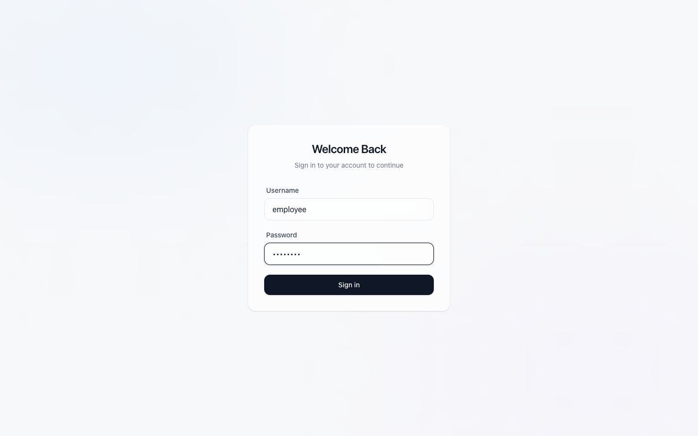

2.  **Start from the dashboard.** `/dashboard` shows the remaining leave days, pending applications and upcoming leave, with quick actions and recent activity. The sidebar lists only the pages the role can open.

    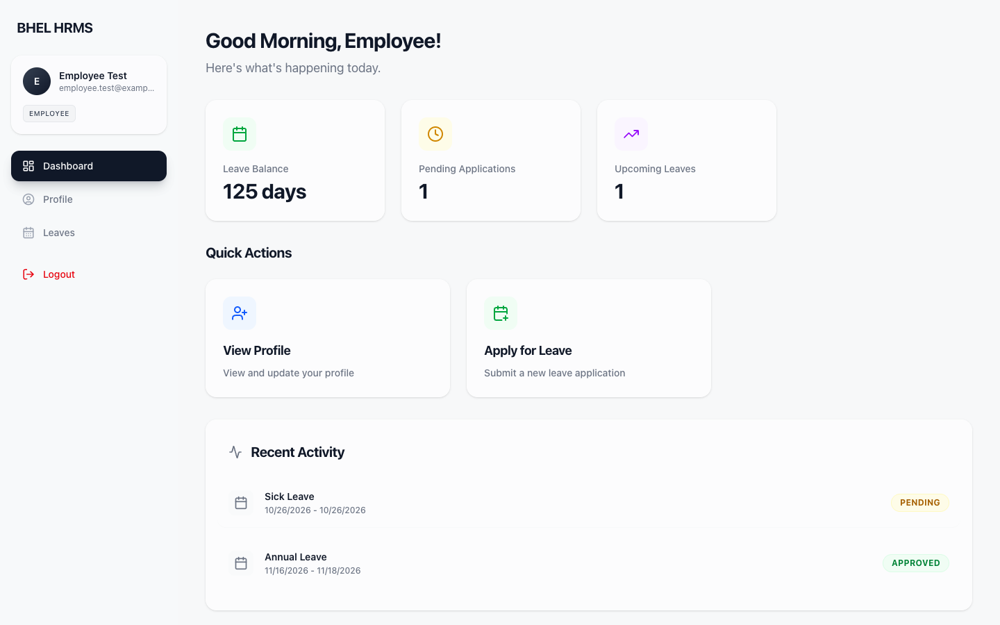

3.  **Apply for leave.** On `/dashboard/leaves/apply`, the employee picks a leave type and dates. The form counts working days, skipping weekends, and blocks the request when it exceeds the remaining balance. The RMI server repeats those checks and also rejects requests that span two years or overlap pending or approved leave.

    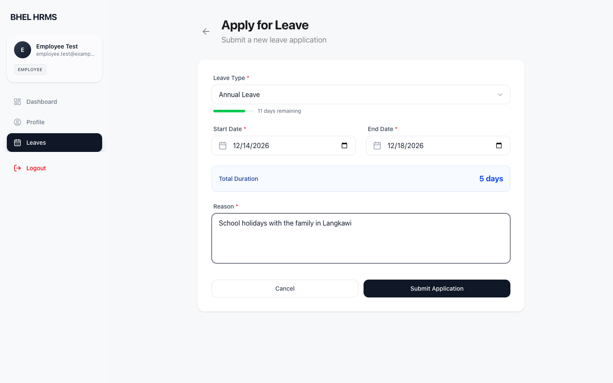

4.  **Review the application.** HR and admins open `/dashboard/approvals`, the queue of pending applications. Each review shows the dates, duration and reason, then approves the request or rejects it with a required comment.

    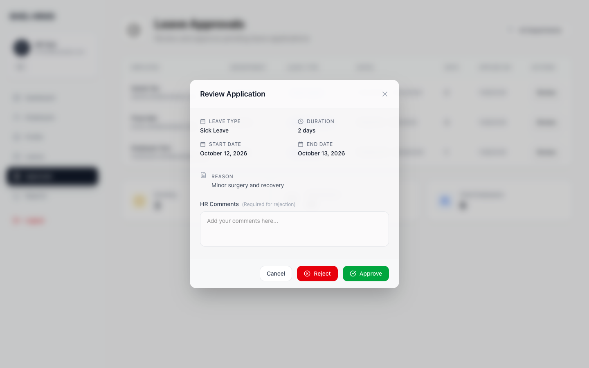

5.  **Track the decision.** The application's page shows its timeline, the approver and their comment. An approval moves the days from remaining to used. While an application is still pending, the employee can cancel it.

    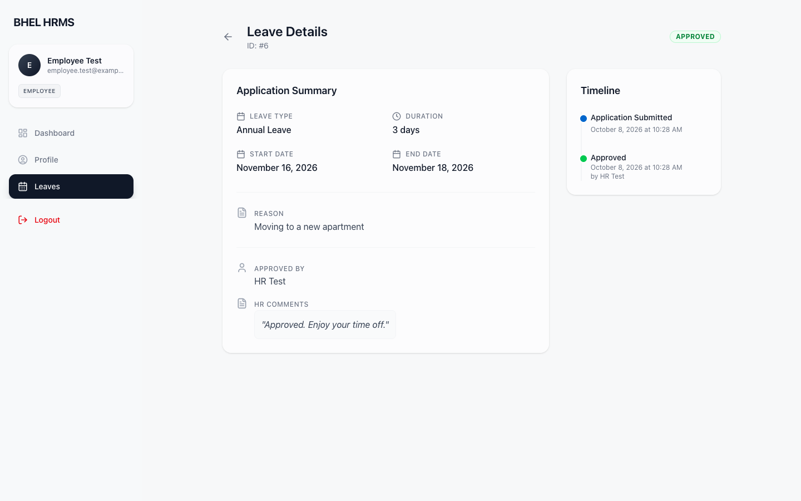

6.  **Register employees.** HR adds staff at `/dashboard/employees/new`. Registration also creates the employee's login, with the IC/passport number as both username and first password. The department sets the role: Admin gives `admin`, Human Resources gives `hr`, and every other department gives `employee`.

    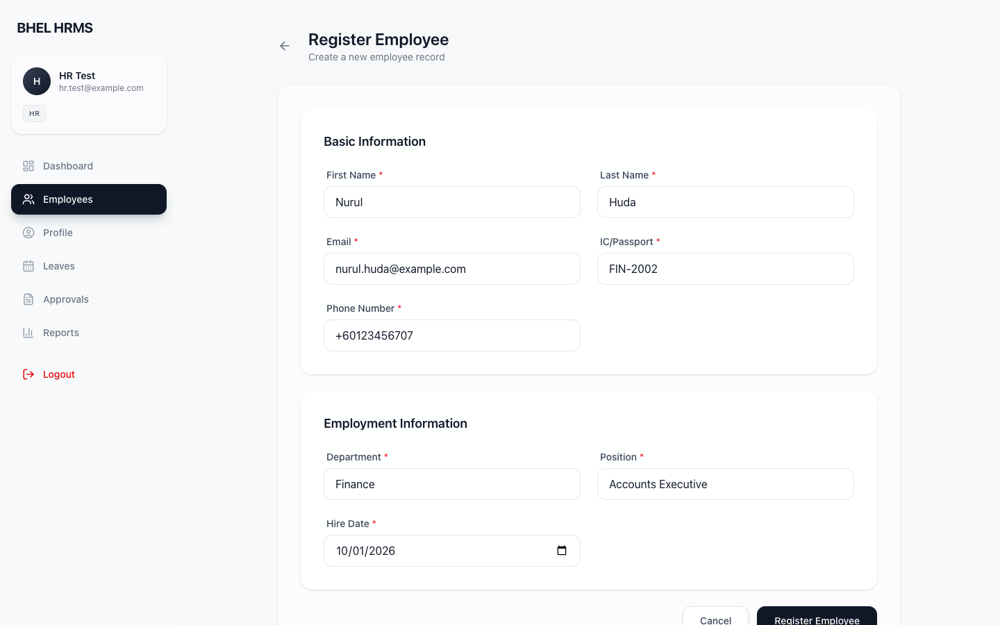

7.  **Keep profiles current.** At `/dashboard/profile/edit`, employees update their email, phone number and family members (spouse, child, parent, sibling or other). The other fields stay locked for HR to edit.

    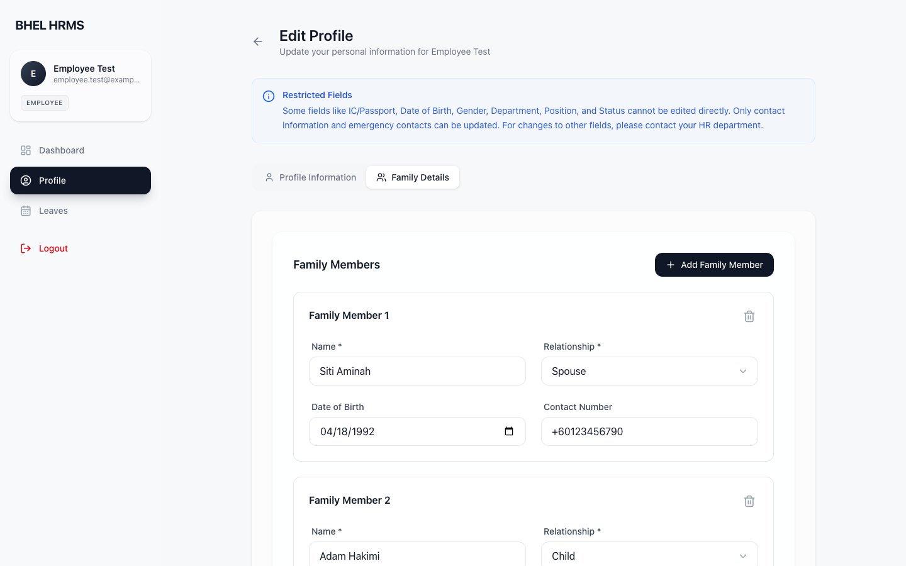

8.  **Generate reports.** `/dashboard/reports` builds yearly reports for one employee, one department or the whole organization. The RMI server renders each one as a PDF with iText. The browser previews it, then downloads it as a PDF or a PNG.

    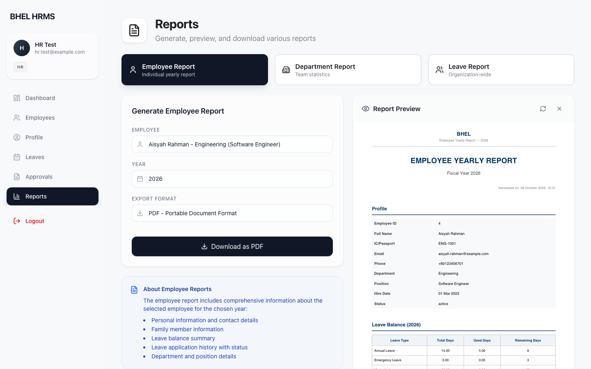

<p align="right"><a href="#readme-top">&uarr;</a></p>

### Features

- **Role-based access.** Spring Security rules on the gateway limit employee registration, the employee directory, leave approvals and reports to `HR` and `ADMIN`. The web app's sidebar follows the same roles.
- **Employee records.** HR registers and edits employees, with a search box and department and status filters.
- **Profiles and families.** Employees keep their own contact details and family members current.
- **Leave balances.** Five leave types, each with a yearly allowance: Annual 14 days, Sick 14, Emergency 3, Maternity 90 and Paternity 7.
- **Leave rules.**
  - The form counts working days, and the server checks them again.
  - A request must fit the remaining balance and stay within one calendar year.
  - It can't overlap pending or approved leave.
- **Approvals.** Approve or reject with comments. Rejections need one.
- **Yearly reports.** Employee, department and organization leave reports as PDFs, with an in-browser preview and PNG export.
- **Distributed back end.** The gateway reaches `EmployeeService`, `LeaveService`, `ReportService` and `UserService` over Java RMI. Only the RMI server opens database connections, through a HikariCP pool.
- **Hashed passwords.** Passwords are stored as BCrypt hashes (12 rounds). The gateway refuses to start without a `JWT_SECRET` of at least 32 bytes.

<p align="right"><a href="#readme-top">&uarr;</a></p>

### Architecture

<picture>
  <source media="(prefers-color-scheme: dark)" srcset="docs/readme/architecture-dark.svg">
  
</picture>

The diagram is drawn with [archify](https://github.com/tt-a1i/archify) from [`architecture.json`](docs/readme/architecture.json) and exported by [`export-architecture.mjs`](docs/readme/export-architecture.mjs).

The three Java processes run from the same jar, `apps/api/target/hrms-1.0-SNAPSHOT.jar`:

| Entry point                                   | Role                                                                             |
| --------------------------------------------- | -------------------------------------------------------------------------------- |
| `hrms.bhel.client.ClientApplication`          | REST gateway on port 8080, and the jar's default main class                      |
| `hrms.bhel.server.RMIServerMain`              | RMI registry and the four remote services on port 1099                           |
| `hrms.bhel.server.config.DatabaseInitializer` | Drops and recreates the tables, then seeds leave types and the three demo logins |

<p align="right"><a href="#readme-top">&uarr;</a></p>

### Tech Stack

- **Languages:** TypeScript 5 and Java 17.
- **Frontend:** Next.js 16 (App Router), React 19, Tailwind CSS 4, zustand, React Hook Form with zod, axios, react-pdf, react-hot-toast and Lucide icons.
- **Backend:** Spring Boot 3.5 (Web, Security, Validation), JJWT, Java RMI, iText 7, jBCrypt, HikariCP and Logback.
- **Data:** PostgreSQL.
- **Tooling:** Bun, Maven, ESLint, Prettier, Husky and commitlint.

<p align="right"><a href="#readme-top">&uarr;</a></p>

<!-- GETTING STARTED -->

## Getting Started

The web app, the gateway and the RMI server run locally from the repository root against one PostgreSQL database. The Java processes read their settings only from environment variables, so each terminal loads the root `.env` first.

<p align="right"><a href="#readme-top">&uarr;</a></p>

### Prerequisites

- [Bun](https://bun.sh/) 1.4.2 — for the repository tooling and the web app.
- [Node.js](https://nodejs.org/) 20.9+ — Next.js runs on it.
- [JDK](https://adoptium.net/) 17+ and [Maven](https://maven.apache.org/) 3.6.3+ — for the gateway and the RMI server.
- [PostgreSQL](https://www.postgresql.org/), tested with 17 — or [Docker](https://www.docker.com/), which step 2 below uses to start one that matches `.env.example`.

<p align="right"><a href="#readme-top">&uarr;</a></p>

### Installation

1.  **Clone the repo.**

    ```sh
    git clone https://github.com/M1KUAPP/bhel.git
    cd bhel
    ```

2.  **Start PostgreSQL.** Skip this step if you already run one, and put its URL and credentials in `.env` instead.

    ```sh
    docker run -d --name bhel-postgres -e POSTGRES_USER=hrms -e POSTGRES_PASSWORD=hrms -e POSTGRES_DB=hrms -p 5432:5432 postgres:17-alpine
    ```

3.  **Configure the environment.** Copy the example and replace the `JWT_SECRET` placeholder, which the gateway refuses, with the output of `openssl rand -hex 32`. Then load `.env` into every terminal you use below.

    ```sh
    cp .env.example .env    # then set JWT_SECRET
    set -a; . ./.env; set +a
    ```

4.  **Build the API and seed the database.** `DatabaseInitializer` drops every table in the database `DATABASE_URL` points at before it recreates them, so never point it at data you want to keep.

    ```sh
    mvn -q -B -f apps/api/pom.xml package
    java -cp apps/api/target/hrms-1.0-SNAPSHOT.jar -Dloader.main=hrms.bhel.server.config.DatabaseInitializer org.springframework.boot.loader.launch.PropertiesLauncher
    ```

5.  **Start the RMI server, then the gateway.** Use two terminals, both loaded with `.env`.

    ```sh
    java -cp apps/api/target/hrms-1.0-SNAPSHOT.jar -Dloader.main=hrms.bhel.server.RMIServerMain org.springframework.boot.loader.launch.PropertiesLauncher   # :1099
    java -jar apps/api/target/hrms-1.0-SNAPSHOT.jar                                                                                                         # http://localhost:8080
    ```

6.  **Start the web app.** In a third terminal, open `http://localhost:3000` and sign in as `employee`, `hr` or `admin`, with the username as the password.

    ```sh
    cd apps/web
    bun install
    bun run dev    # http://localhost:3000
    ```

7.  **Run the checks.** From the repository root, run `bun install` once for the root tooling and Git hooks. The web app needs its own `bun install` from step 6. `bun run check` runs Prettier, then the web app's ESLint, typecheck and production build, then `mvn package` when `mvn` is installed.

    ```sh
    bun run check
    ```

<p align="right"><a href="#readme-top">&uarr;</a></p>

<!-- ROADMAP -->

## Roadmap

See [open issues](https://github.com/M1KUAPP/bhel/issues) for a full list of proposed features (and known issues).

<p align="right"><a href="#readme-top">&uarr;</a></p>

<!-- CONTRIBUTING -->

## Team

<a href="https://github.com/M1KUAPP/bhel/graphs/contributors">
  
</a>

Made with [contrib.rocks](https://contrib.rocks).

<p align="right"><a href="#readme-top">&uarr;</a></p>

<!-- LICENSE -->

## License

See [LICENSE](LICENSE) for more information.

<p align="right"><a href="#readme-top">&uarr;</a></p>

<!-- ACKNOWLEDGMENTS -->

## Acknowledgments

- [iText](https://itextpdf.com/) — PDF report generation.
- [react-pdf](https://github.com/wojtekmaj/react-pdf) — in-browser PDF preview.
- [Lucide](https://lucide.dev) — icons.
- [archify](https://github.com/tt-a1i/archify) — architecture diagrams.
- [Shields.io](https://shields.io)
- [contrib.rocks](https://contrib.rocks)

<p align="right"><a href="#readme-top">&uarr;</a></p>

<!-- MARKDOWN LINKS & IMAGES -->

[typescript-badge]: https://img.shields.io/badge/TypeScript-3178C6?style=for-the-badge&logo=typescript&logoColor=white
[typescript-url]: https://www.typescriptlang.org/
[java-badge]: https://img.shields.io/badge/Java-ED8B00?style=for-the-badge
[java-url]: https://dev.java/
[nextjs-badge]: https://img.shields.io/badge/Next.js-000000?style=for-the-badge&logo=nextdotjs&logoColor=white
[nextjs-url]: https://nextjs.org/
[react-badge]: https://img.shields.io/badge/React-61DAFB?style=for-the-badge&logo=react&logoColor=black
[react-url]: https://react.dev/
[tailwindcss-badge]: https://img.shields.io/badge/Tailwind_CSS-06B6D4?style=for-the-badge&logo=tailwindcss&logoColor=white
[tailwindcss-url]: https://tailwindcss.com/
[springboot-badge]: https://img.shields.io/badge/Spring_Boot-6DB33F?style=for-the-badge&logo=springboot&logoColor=white
[springboot-url]: https://spring.io/projects/spring-boot
[springsecurity-badge]: https://img.shields.io/badge/Spring_Security-6DB33F?style=for-the-badge&logo=springsecurity&logoColor=white
[springsecurity-url]: https://spring.io/projects/spring-security
[jwt-badge]: https://img.shields.io/badge/JWT-000000?style=for-the-badge&logo=jsonwebtokens&logoColor=white
[jwt-url]: https://jwt.io/
[postgresql-badge]: https://img.shields.io/badge/PostgreSQL-4169E1?style=for-the-badge&logo=postgresql&logoColor=white
[postgresql-url]: https://www.postgresql.org/
[apachemaven-badge]: https://img.shields.io/badge/Apache_Maven-C71A36?style=for-the-badge&logo=apachemaven&logoColor=white
[apachemaven-url]: https://maven.apache.org/
[bun-badge]: https://img.shields.io/badge/Bun-000000?style=for-the-badge&logo=bun&logoColor=white
[bun-url]: https://bun.sh/
